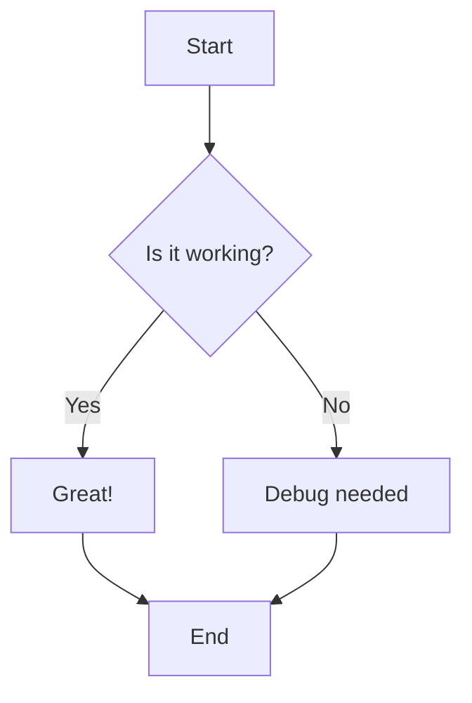
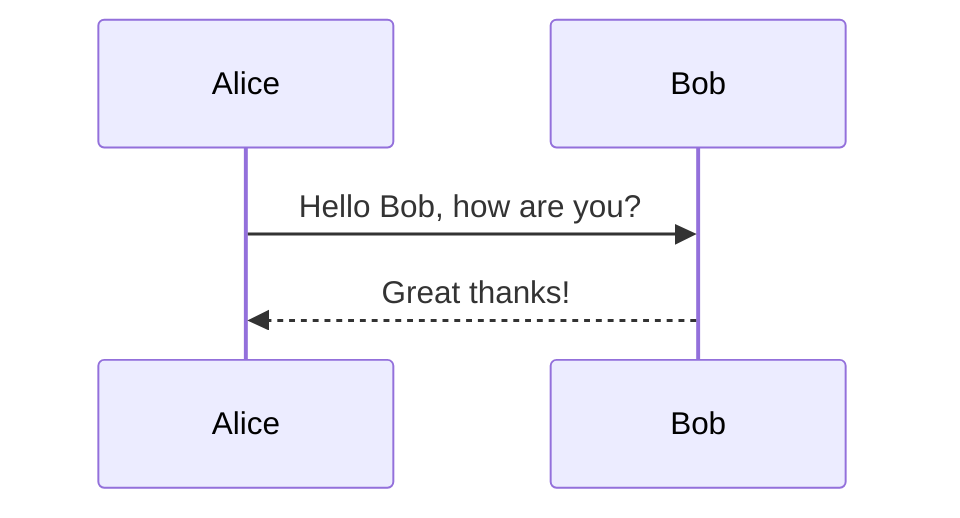

# Mermaid Test Page

This is a simple test to verify Mermaid diagrams are rendering correctly.

## Simple Flowchart

## Sequence Diagram

If you can see the diagrams above, Mermaid is working correctly!
